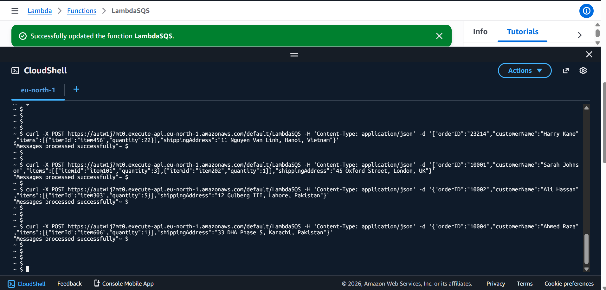
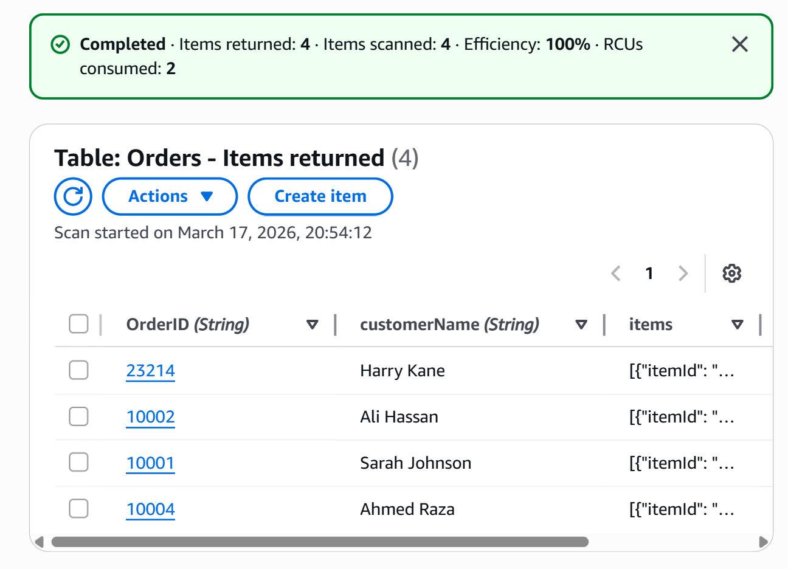
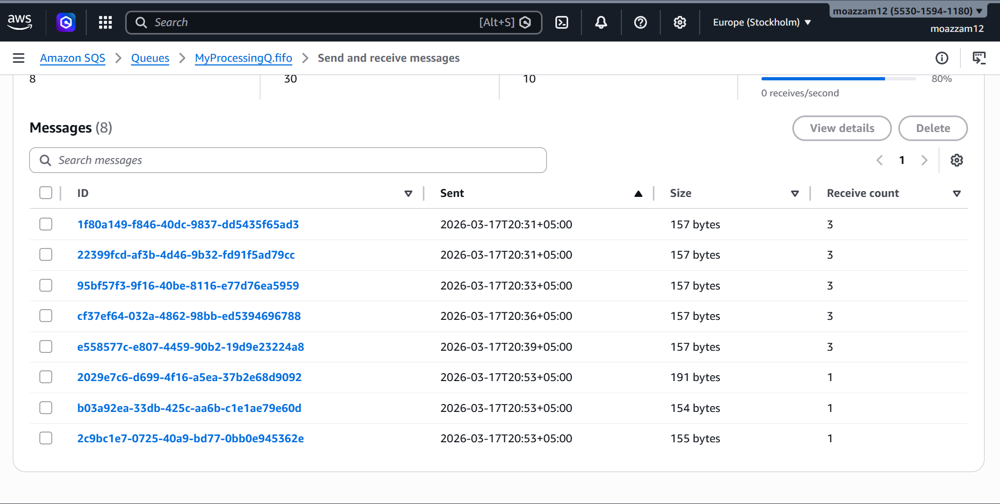
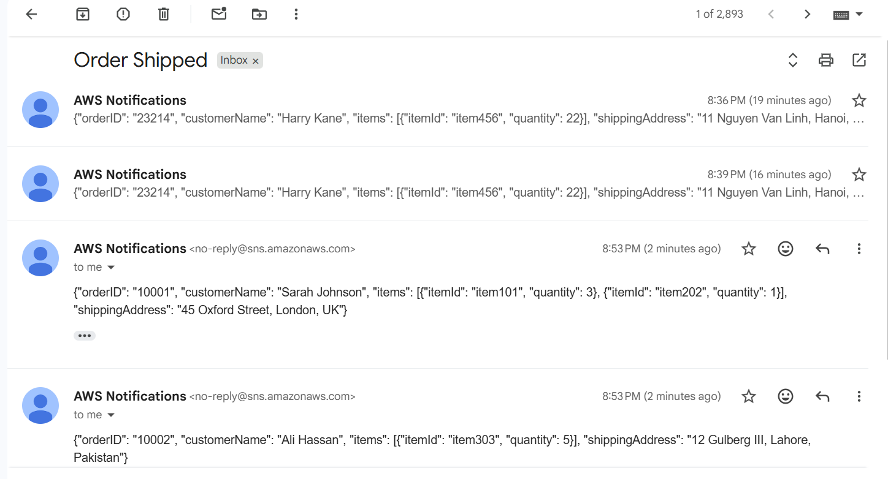

<div align="center">


# ☁️ AWS Serverless Order Processing System

*A fully serverless, cloud-native order processing backend built on AWS —*
*featuring real-time queuing, instant notifications, and persistent storage.*

<br/>

[](https://aws.amazon.com)
[](https://aws.amazon.com/serverless/)
[](https://python.org)
[](LICENSE)
[](https://moazzamhafeez1093.github.io/aws-serverless-order-processing-system-lambda-sqs-sns-dynamodb)

<br/>

### 🔴 [View Live Demo](https://moazzamhafeez1093.github.io/aws-serverless-order-processing-system-lambda-sqs-sns-dynamodb)

<br/>

> **No servers. No maintenance. Infinitely scalable.**

</div>

---

## 📋 Table of Contents

- [Overview](#-overview)
- [Architecture](#️-architecture)
- [AWS Services](#️-aws-services-used)
- [Project Structure](#-project-structure)
- [How to Deploy](#-how-to-deploy)
- [Screenshots](#-screenshots)
- [Sample Payload](#-sample-api-payload)
- [Key Concepts](#-key-concepts-demonstrated)
- [Author](#-author)

---

## 📌 Overview

This project implements a **production-ready order processing system** using a completely serverless architecture on AWS. When a client sends an order via HTTP, the system automatically handles the full lifecycle:

<br/>

<div align="center">

| Step | Service | Action |
|:----:|---------|--------|
| 1️⃣ | **API Gateway** | Receives HTTP POST request |
| 2️⃣ | **AWS Lambda** | Executes order processing logic |
| 3️⃣ | **Amazon SQS FIFO** | Queues message for downstream processing |
| 4️⃣ | **Amazon SNS** | Fires real-time email notification |
| 5️⃣ | **Amazon DynamoDB** | Persists order record permanently |
| 6️⃣ | **CloudWatch** | Logs and monitors everything |

</div>

---

## 🏗️ Architecture

<div align="center">

```
                    ┌──────────────────────────────────────┐
                    │           CLIENT REQUEST              │
                    │         HTTP POST /order              │
                    └──────────────────┬───────────────────┘
                                       │
                                       ▼
                    ┌──────────────────────────────────────┐
                    │           API GATEWAY                 │
                    │   Public HTTPS Endpoint (REST/HTTP)   │
                    └──────────────────┬───────────────────┘
                                       │
                                       ▼
                    ┌──────────────────────────────────────┐
                    │           AWS LAMBDA                  │
                    │     Python 3.12 · Auto-scaling        │
                    └──────┬─────────────┬────────┬────────┘
                           │             │        │
              ┌────────────▼───┐  ┌──────▼───┐  ┌▼─────────────┐
              │  AMAZON SQS    │  │  AMAZON  │  │   AMAZON     │
              │   FIFO Queue   │  │   SNS    │  │   DYNAMODB   │
              │  Ordered msgs  │  │  Email   │  │  Persistent  │
              │  Deduplication │  │  Alerts  │  │   Storage    │
              └────────┬───────┘  └──────────┘  └──────────────┘
                       │
                       ▼
              ┌────────────────┐
              │   CLOUDWATCH   │
              │  Logs & Metrics│
              └────────────────┘
```

</div>

---

## 🛠️ AWS Services Used

<div align="center">

| Service | Icon | Role | Key Feature |
|---------|------|------|-------------|
| **API Gateway** | 🌐 | Entry point — accepts `POST /order` | Public HTTPS endpoint |
| **AWS Lambda** | ⚡ | Core processing logic (Python 3.12) | Serverless, auto-scaling |
| **Amazon SQS FIFO** | 📬 | Message queue for downstream processing | Ordered & deduplicated |
| **Amazon SNS** | 📧 | Real-time email notifications | Pub/Sub fan-out |
| **Amazon DynamoDB** | 🗄️ | Persistent NoSQL order storage | Single-digit ms latency |
| **AWS IAM** | 🔐 | Role & permission management | Least-privilege access |
| **CloudWatch** | 📊 | Logging, metrics & monitoring | Automatic, zero-config |

</div>

---

## 📁 Project Structure

```
aws-serverless-order-processing-system/
│
├── 📄  index.html                  ←  Live demo frontend (GitHub Pages)
├── 🐍  lambda_function.py          ←  Lambda function source code
├── 🔐  CustomLambdaPolicy.json     ←  IAM policy for Lambda permissions
├── 📖  README.md                   ←  You are here
│
└── 📸  screenshots/
    ├── architecture.png            ←  System architecture diagram
    ├── cloudshell-success.png      ←  Successful API call via CloudShell
    ├── dynamodb-orders.png         ←  Live orders in DynamoDB
    ├── sqs-messages.png            ←  Messages queued in SQS
    └── email-notification.png      ←  SNS email alert received
```

---

## 🚀 How to Deploy

> **Prerequisites:** AWS Account (free tier works) · Basic AWS Console knowledge

<br/>

### Step 1 — Create SQS FIFO Queue

```
AWS Console → SQS → Create Queue
```

- Type: **FIFO**
- Name: `MyProcessingQ.fifo`
- Enable **Content-based deduplication** ✅
- Enable **High throughput FIFO** ✅
- Save the **Queue ARN** and **Queue URL**

---

### Step 2 — Create Lambda Function

```
AWS Console → Lambda → Create Function → Author from scratch
```

- Name: `LambdaSQS`
- Runtime: **Python 3.12**
- Leave default execution role (we'll attach a custom policy later)

---

### Step 3 — Create SNS Topic

```
AWS Console → SNS → Topics → Create Topic
```

- Type: **Standard**
- Name: `OrderNotification`
- Create a **subscription** → Protocol: Email → enter your address
- **Confirm** the subscription from your inbox ✅
- Save the **Topic ARN**

---

### Step 4 — Create DynamoDB Table

```
AWS Console → DynamoDB → Create Table
```

| Setting | Value |
|---------|-------|
| Table name | `Orders` |
| Partition key | `OrderID` (String) |
| Sort key | `customerName` (String) |

- Save the **Table ARN**

---

### Step 5 — Create & Attach IAM Policy

```
AWS Console → IAM → Policies → Create Policy → JSON
```

1. Paste `CustomLambdaPolicy.json` from this repo
2. Replace the **3 ARN placeholders** with your actual ARNs:

| Line | Placeholder | Replace With |
|------|-------------|--------------|
| 7 | `YOUR_SQS_ARN` | SQS Queue ARN |
| 12 | `YOUR_SNS_ARN` | SNS Topic ARN |
| 17 | `YOUR_DYNAMODB_ARN` | DynamoDB Table ARN |

3. Name it `LambdaCustomPolicy` → **Create**
4. Attach to your Lambda function's **execution role**

---

### Step 6 — Deploy Lambda Code

```
Lambda → Your Function → Code Tab
```

1. Paste contents of `lambda_function.py`
2. Update **line 6** → your DynamoDB table name
3. Update **line 39** → your SQS queue URL
4. Update **line 49** → your SNS topic ARN
5. Click **Deploy** ✅

---

### Step 7 — Create API Gateway Trigger

```
Lambda → Add Trigger → API Gateway
```

- Create new **HTTP API**
- Security: **Open**
- In API Gateway → Routes → change `ANY` to **`POST`**
- Copy the **Invoke URL**

---

### Step 8 — Test It Live

```bash
curl -X POST https://YOUR_API_URL/default/LambdaSQS \
  -H 'Content-Type: application/json' \
  -d '{
    "orderID":         "10001",
    "customerName":    "John Doe",
    "items":           [{"itemId": "item001", "quantity": 2}],
    "shippingAddress": "123 Main Street, City, Country"
  }'
```

> **Expected Response:** `"Messages processed successfully"` ✅

---

## 📸 Screenshots

<details>
<summary><strong>CloudShell — Successful API Response</strong></summary>
<br/>



</details>

<details>
<summary><strong>DynamoDB — Orders Table with Live Data</strong></summary>
<br/>



</details>

<details>
<summary><strong>SQS — Messages in Queue</strong></summary>
<br/>



</details>

<details>
<summary><strong>Email Notification from SNS</strong></summary>
<br/>



</details>

---

## 📦 Sample API Payload

```json
{
  "orderID":         "10005",
  "customerName":    "Mia Chen",
  "items": [
    { "itemId": "item707", "quantity": 6 },
    { "itemId": "item808", "quantity": 2 }
  ],
  "shippingAddress": "99 Nanjing Road, Shanghai, China"
}
```

---

## 💡 Key Concepts Demonstrated

<div align="center">

| Concept | Description |
|---------|-------------|
| ⚡ **Serverless Architecture** | No EC2 instances — zero infrastructure to manage |
| 🔁 **Event-driven Design** | Lambda auto-triggers on every API Gateway request |
| 🔗 **Decoupled Processing** | SQS isolates the API from downstream consumers |
| 📡 **Fan-out Pattern** | Single Lambda writes to SQS + SNS + DynamoDB in parallel |
| 🔐 **IAM Least Privilege** | Custom policy grants only the exact permissions needed |
| 📈 **Auto-scaling** | Lambda scales from 0 to thousands of concurrent requests |

</div>

---

## 👤 Author

<div align="center">

**Moazzam Hafeez**

[](https://github.com/MoazzamHafeez1093)

</div>

---

## 📄 License

<div align="center">

This project is open source and available under the **[MIT License](LICENSE)**.

<br/>

*Built with ❤️ on AWS Serverless*

</div>
